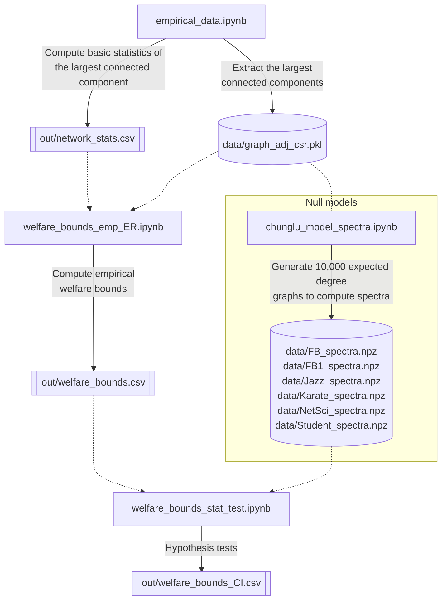

# Welfare Bounds for Linear-Quadratic Network Games

This repository contains replication materials for the paper **"[Welfare bounds for linear-quadratic network games](https://papers.ssrn.com/sol3/papers.cfm?abstract_id=5706124)"**.  
The purpose of this repository is to provide code and data to reproduce the results presented in the **Table 1** of the paper.

---

## 🧩 Environment

Below is the output of the environment check script:

```
Package versions:
Python:     3.13.2 | packaged by conda-forge | (main, Feb 17 2025, 14:02:48) [Clang 18.1.8 ]
NumPy:      2.1.3
Pandas:     2.2.3
Matplotlib:  3.10.1
NetworkX:   3.4.2
Graph-tool:  2.92 (commit , )
Standard libraries (time, json, pickle, datetime, typing): built-in modules
```

To install `graph-tool` via conda-forge, run:
```bash
conda create --name gt -c conda-forge graph-tool
conda activate gt
```
For more details, visit the [official installation guide](https://graph-tool.skewed.de/installation.html).

## 📊 Notebook Dependency Diagram

To reproduce **Table 1**, the main outputs are `out/welfare_bounds.csv` and `out/welfare_bounds_CI.csv`.  
The following diagram summarizes the dependencies among the notebooks and the intermediate data files used in the analysis.


